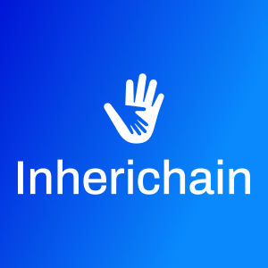

# Inherichain   

A wallet that has inheritance built-in on the Ethereum Blockchain.

## Description

Ethereum wallets are created using a Seed or Private Key and can send and receive almost any ethereum assets and create contracts. But it lacks a significant feature, which is to retrieve the assets in case of the wallet owner's demise.

Inherichain is a Wallet Contract with almost all the features of a normal EOA (Externally Owned Account). Along with that, it also can transfer the ownership of the contract wallet to the specified Heir.

## Function List & Specification

A basic description of all the functions, modifiers, and events are specified in the doc folder [**here**](docs/Inherichain.md).

## User Specification

**Admin** can :
- Update the Backup Owner.
- Update the Heir (Resets the Claim Process).
- Update the Deadlines.
- Add new Approvers.
- Delete old Approvers.
- Interact with Other Contracts (ERC20 Transfers, etc.).
- Withdraw some or all ETH.
- Transfer some or all ETH.
- Deploy Contracts.

**Backup Owner** can :
- Update the Owner.

**Heir** can :
- Start the Claim.
- Access Ownership using Approver Votes or Complete Deadline.

**Approver** can :
- Approve or Reject Heir.
- Initiate Charity Process.

**Charity** can :
- Access Ownership after approver Initiation.

**Every User** can :
- Deposit ETH and other assets.

## Enhancement to do:
- Involve Kleros if heir & owner demise at the same time to choose what to do with the funds.
- Introduce Vote weightage for approvers.
- Mechanism to divide the contract asset into parts based on multiple heirs. Expanding on the same, giving different % for different Heir.

## How to Run the Project

1. Create a new folder.

2. Copy the Git Clone URL from GitHub: https://github.com/remedcu/Inherichain.git

3. Clone the Repository.

`git clone https://github.com/remedcu/Inherichain.git`

4. In a command line, inside the Inherichain folder, write `npm i` or `npm install`

5. Now run `ganache-cli` and copy the mnemonic, address, and private key part for later use. (Make sure it runs on port 8545 if you intend to run the `truffle test` command).

6. In a command line, run `truffle migrate --reset`.

7. (Optional) If you want, you can run the `truffle test` to see if it passes all tests or not.

8. To run the frontend part, just use `npm start` and it will start a server in localhost.

## How to Test the Contract

1. Please follow the step 1 - 6 of *How to Run the Project*.

2. Now start the test using:

`npm run test`

**Note**: You can also use the `truffle test` to test the smart contract if you already have `ganache-cli` or Ganache GUI running in the background for testing in the local network.

## Documentation

Using solidity-docgen: [Inherichain.md](docs/Inherichain.md)